<div align="center">

# <span style="font-size:2.5em">Programmentwurf</span>

## <span style="font-size:2em">Snackoverflow</span>

<br><br>

<span style="font-size:1.5em"><b>Name:</b> Weber, Til und Imming, Mathis</span>  
<span style="font-size:1.5em"><b>Matrikelnummer:</b> 7456543 und </span>  

<br><br>

<span style="font-size:1.5em"><b>Abgabedatum:</b> 28. April 2025</span>

</div>

<!-- Seitenumbruch für PDF-Export -->
<div style="page-break-after: always;"></div>


# Programmentwurf

<!--toc:start-->
- [1. Einführung](#1-einführung)
  - [1.1 Übersicht über die Applikation](#11-übersicht-über-die-applikation)
  - [1.2 Wie startet man die Applikation?](#12-wie-startet-man-die-applikation)
  - [1.3 Wie testet man die Applikation?](#13-wie-testet-man-die-applikation)
- [2. Clean Architecture](#2-clean-architecture)
  - [2.1 Was ist Clean Architecture?](#21-was-ist-clean-architecture)
  - [2.2 Analyse der Dependency Rule](#22-analyse-der-dependency-rule)
    - [2.2.1 Positiv-Beispiel: DefaultRecipeRepository](#221-positiv-beispiel-defaultreciperepository)
    - [2.2.2 Positiv-Beispiel: DefaultUserRepository](#222-positiv-beispiel-defaultuserrepository)
  - [2.3 Analyse der Schichten](#23-analyse-der-schichten)
    - [2.3.1 Schicht: Applikations-Schicht](#231-schicht-applikations-schicht)
    - [2.3.2 Schicht: Domain-Schicht](#232-schicht-domain-schicht)
- [3. SOLID](#3-solid)
  - [3.1 Analyse Single-Responsibility-Principle (SRP)](#31-analyse-single-responsibility-principle-srp)
    - [3.1.1 Positiv-Beispiel: DefaultCreateUser](#311-positiv-beispiel-defaultcreateuser)
    - [3.1.2 Negativ-Beispiel: DefaultUserRepository](#312-negativ-beispiel-defaultuserrepository)
  - [3.2 Analyse Open-Closed-Principle (OCP)](#32-analyse-open-closed-principle-ocp)
    - [3.2.1 Positiv-Beispiel: RecipeFinder](#321-positiv-beispiel-recipefinder)
    - [3.2.2 Negativ-Beispiel: DefaultUserRepository](#322-negativ-beispiel-defaultuserrepository)
  - [3.3 Analyse Interface-Segregation-Principle (ISP)](#33-analyse-interface-segregation-principle-isp)
    - [3.3.1 Positiv-Beispiel: LoginUser und LogoutUser](#331-positiv-beispiel-loginuserund-logoutuser)
    - [3.3.2 Negativ-Beispiel: RecipeRepository](#332-negativ-beispiel-reciperepository)
- [4. Weitere Prinzipien](#4-weitere-prinzipien)
  - [4.1 Analyse GRASP: Geringe Kopplung](#41-analyse-grasp-geringe-kopplung)
    - [4.1.1 Positives-Beispiel: DefaultEditRecipe](#411-positives-beispiel-defaulteditrecipe)
    - [4.1.2 Negatives-Beispiel: DefaultGetShoppingList](#412-negatives-beispiel-defaultgetshoppinglist)
  - [4.2 Analyse GRASP: Hohe Kohäsion](#42-analyse-grasp-hohe-kohäsion)
  - [4.3 Don’t Repeat Yourself (DRY)](#43-dont-repeat-yourself-dry)
- [5. Unit Tests](#5-unit-tests)
  - [5.1 Zehn Unit Tests - Tabelle](#51-zehn-unit-tests---tabelle)
  - [5.2 ATRIP](#52-atrip)
    - [5.2.1 ATRIP: Automatic](#521-atrip-automatic)
    - [5.2.2 ATRIP: Thorough](#522-atrip-thorough)
    - [5.2.3 ATRIP: Professional](#523-atrip-professional)
  - [5.3 Code Coverage](#53-code-coverage)
  - [5.4 Fakes und Mocks](#54-fakes-und-mocks)
- [6. Domain-Driven-Design (DDD)](#6-domain-driven-design-ddd)
  - [6.1 Ubiquitous Language](#61-ubiquitous-language)
  - [6.2 Entities - User Entity](#62-entities---user-entity)
  - [6.3 Value Objects - EmailAdress Object](#63-value-objects---emailadress-object)
  - [6.4 Aggregates - Recipe Aggregate](#64-aggregates---recipe-aggregate)
  - [6.5 Repositories - Customer Repository](#65-repositories---customer-repository)
- [7. Refactoring](#7-refactoring)
  - [7.1 Code Smells](#71-code-smells)
  - [7.2 Refactorings](#72-refactorings)
- [8. Design Patterns](#8-design-patterns)
  - [8.1 Strategy Pattern](#81-strategy-pattern)
  - [8.2 Builder Pattern](#82-builder-pattern)
<!--toc:end-->


# 1. Einführung

## 1.1 Übersicht über die Applikation
Die Anwendung Snackoverflow ist ein lokales Rezeptmanagement Tool. User können mithilfe der Anwendung neue Rezepte erstellen, bestehende Rezepte sich ansehen und damit dann "live kochen". Zudem besteht die Möglichkeit, sich Zutaten auf eine  Einkaufsliste zu schreiben.


## 1.2 Wie startet man die Applikation?

**Voraussetzungen:**
- Java Development Kit (JDK) Version 19
- Apache Maven Version 4.0.0
 
**Anleitung**

1. **Repository klonen:**
   ```sh
   git clone https://github.com/mathisi/snackoverflow.git
   cd snackoverflow
   ```

2. **Projekt bauen:**
   ```sh
   mvn clean install
   ```

3. **Applikation starten:**
   ```sh
   cd 0-snackoverflow-main
   mvn exec:java -Dexec.mainClass="dhbw.ase.snackoverflow.main.Main"
   ```
Die Anwendung kann nun über Eingaben der Tastatur verwendet werden.

## 1.3 Wie testet man die Applikation?

```shell
cd snackoverflow
mvn test
```
Die Testergebnisse werden daraufhin im Terminal angezeigt, für jedes Layer der clean architecture einzelnd:

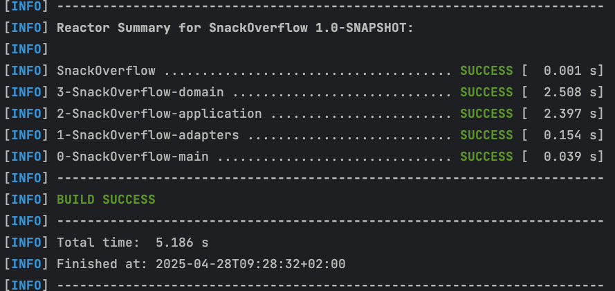


# 2. Clean Architecture

## 2.1 Was ist Clean Architecture?
Clean Architecture ist ein Software-Design-Ansatz, der darauf abzielt, langlebige und flexible Systeme zu bauen. Die Kernidee ist, die zentrale Geschäfts- und Anwendungslogik (Domain & Application Code) strikt von äußeren technischen Details wie UI, Datenbanken oder Frameworks (Plugins & Adapters) zu trennen.   

Dies geschieht durch eine Schichtenstruktur (wie eine Zwiebel) und die Dependency Rule: Abhängigkeiten dürfen immer nur von außen nach innen zeigen. Dadurch bleibt der Kern unabhängig und testbar, während äußere Technologien (Plugins) leichter ausgetauscht werden können, ohne den Kern zu beeinträchtigen. Das Ziel ist, Technologieentscheidungen aufschieben oder revidieren zu können und so die Wartbarkeit und Langlebigkeit der Software zu erhöhen.    

## 2.2 Analyse der Dependency Rule

### 2.2.1 Positiv-Beispiel: `DefaultRecipeRepository`

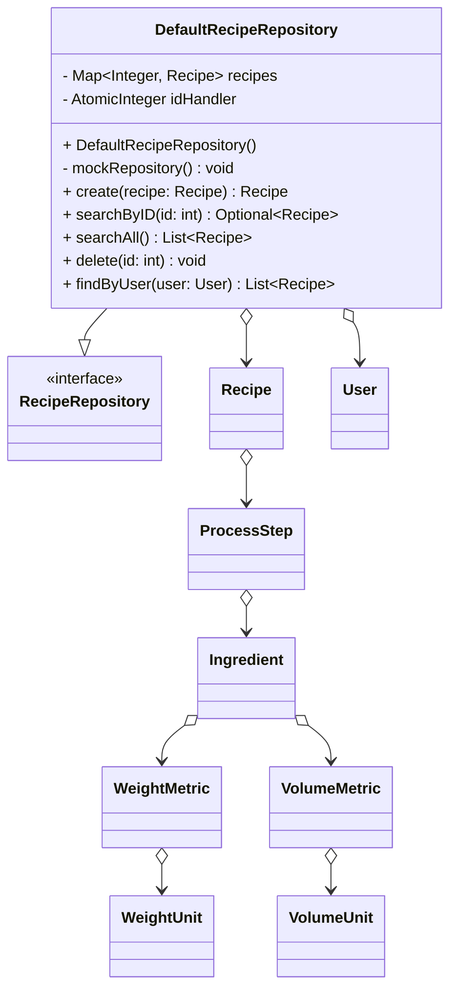
```mermaid
classDiagram
    class DefaultRecipeRepository {
        - Map~Integer, Recipe~ recipes
        - AtomicInteger idHandler
        + DefaultRecipeRepository()
        - mockRepository() void
        + create(recipe: Recipe) Recipe
        + searchByID(id: int) Optional~Recipe~
        + searchAll() List~Recipe~
        + delete(id: int) void
        + findByUser(user: User) List~Recipe~
    }
    
    class RecipeRepository {
        <<interface>>
    }

    class Recipe
    class User
    class Ingredient
    class ProcessStep
    class WeightMetric
    class WeightUnit
    class VolumeMetric
    class VolumeUnit

    DefaultRecipeRepository --|> RecipeRepository
    DefaultRecipeRepository o--> Recipe
    DefaultRecipeRepository o--> User
    Recipe o--> ProcessStep
    ProcessStep o--> Ingredient
    Ingredient o--> WeightMetric
    Ingredient o--> VolumeMetric
    WeightMetric o--> WeightUnit
    VolumeMetric o--> VolumeUnit
```
Die Klasse `DefaultRecipeRepository` liegt auf Application Ebene und hängt von dem Interface `RecipeRepository` sowie sämtlichen Entities ab, die auf Domain Ebene liegen. Dadurch wird die Dependency Rule eingehalten, da Abhängigkeiten nur von außen nach innen verlaufen, und nicht von innen nach außen.

### 2.2.2 Positiv-Beispiel: `DefaultUserRepository`

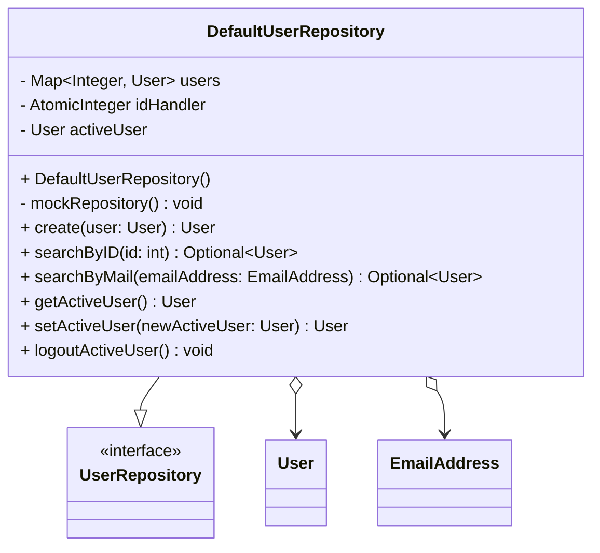
```mermaid
classDiagram
    class DefaultUserRepository {
        - Map~Integer, User~ users
        - AtomicInteger idHandler
        - User activeUser
        + DefaultUserRepository()
        - mockRepository() void
        + create(user: User) User
        + searchByID(id: int) Optional~User~
        + searchByMail(emailAddress: EmailAddress) Optional~User~
        + getActiveUser() User
        + setActiveUser(newActiveUser: User) User
        + logoutActiveUser() void
    }

    class UserRepository {
        <<interface>>
    }

    class User
    class EmailAddress

    DefaultUserRepository --|> UserRepository
    DefaultUserRepository o--> User
    DefaultUserRepository o--> EmailAddress


```

Die Klasse `DefaultUserRepository` liegt auf Application Ebene und hängt von dem Interface `UserRepository` sowie sämtlichen Entities ab, die auf Domain Ebene liegen. Dadurch wird die Dependency Rule eingehalten, da Abhängigkeiten nur von außen nach innen verlaufen, und nicht von innen nach außen.

## 2.3 Analyse der Schichten

### 2.3.1 Schicht: Applikations-Schicht

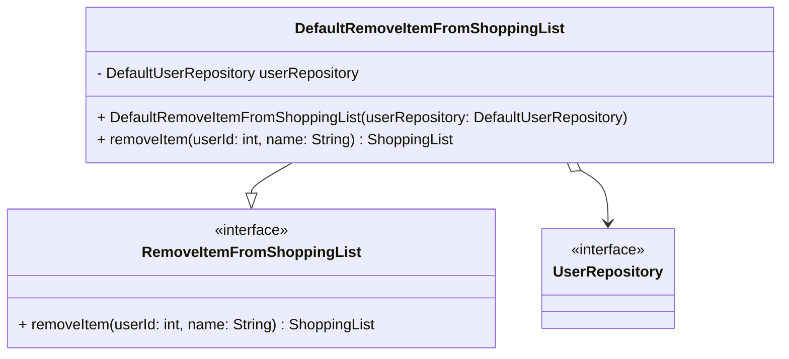
```mermaid
classDiagram
    class DefaultRemoveItemFromShoppingList {
        - DefaultUserRepository userRepository
        + DefaultRemoveItemFromShoppingList(userRepository: DefaultUserRepository)
        + removeItem(userId: int, name: String) ShoppingList
    }

    class RemoveItemFromShoppingList {
        <<interface>>
        + removeItem(userId: int, name: String) ShoppingList
    }

    class UserRepository {
        <<interface>>
    }

    DefaultRemoveItemFromShoppingList --|> RemoveItemFromShoppingList
    DefaultRemoveItemFromShoppingList o--> UserRepository

```

*Aufgabe*:
Die Klasse `DefaultRemoveItemFromShoppingList`repräsentiert in der Anwendung den Use Case, dass Nutzer eine Zutat von ihrer ShoppingList entfernen können. Dabei pflegt es Abhängigkeiten zu dem Interface `RemoveItemFromShoppingList` und der Klasse `UserRepository`. 

*Einordnung in Clean Architecture*:
Die Klasse gehört in die Applikations Schicht, da sie Geschäftslogik repräsentiert, nämlich das Entfernen von Zutaten von der ShoppingList. Sie kapselt die Geschäftslogik von der Datenbank-Implementierung sinnvoll ab, und pflegt lediglich Abhängigkeiten zu Interfaces auf Domain Ebene.

### 2.3.2 Schicht: Domain-Schicht
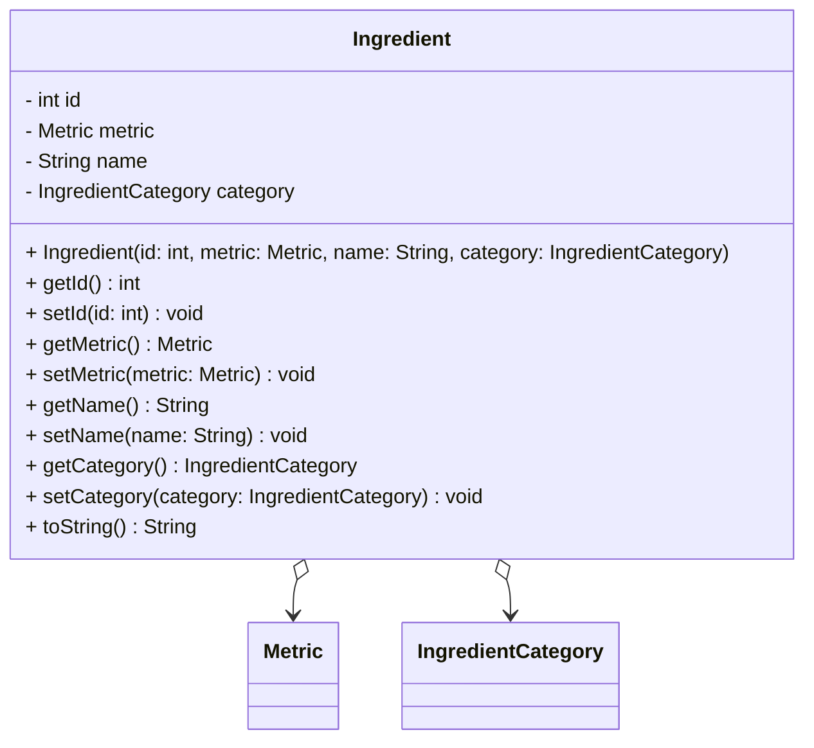
```mermaid
classDiagram
    class Ingredient {
        - int id
        - Metric metric
        - String name
        - IngredientCategory category
        + Ingredient(id: int, metric: Metric, name: String, category: IngredientCategory)
        + getId() int
        + setId(id: int) void
        + getMetric() Metric
        + setMetric(metric: Metric) void
        + getName() String
        + setName(name: String) void
        + getCategory() IngredientCategory
        + setCategory(category: IngredientCategory) void
        + toString() String
    }

    class Metric
    class IngredientCategory

    Ingredient o--> Metric
    Ingredient o--> IngredientCategory
```
*Aufgabe*:
Die Klasse `Ingredient`repräsentiert in der Anwendung eine Zutat für ein Rezept. Dabei hat es Abhängigkeiten zu den Klassen `Metric` und `IngredientCategory`, die genaue Einzelheiten zu der Zutat darstellen.

*Einordnung in Clean Architecture*:
Die Klasse gehört in die Domain-Schicht, da sie eine zentrale Aufgabe der Anwendung ist. Sie hat Abhängigkeiten lediglich auf Domain Schicht und kann von jeder Klasse auf Application Schicht konsumiert werden.

# 3. SOLID

## 3.1 Analyse Single-Responsibility-Principle (SRP)

### 3.1.1 Positiv-Beispiel: `DefaultCreateUser`
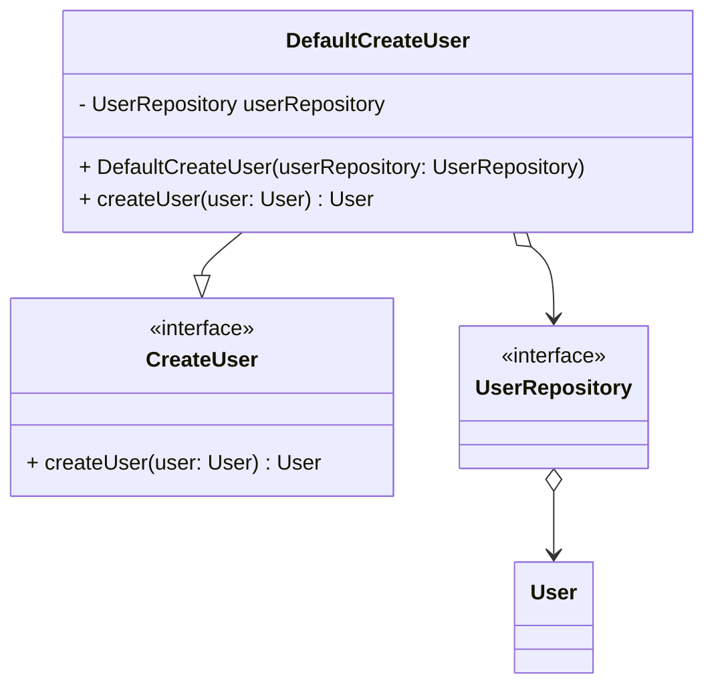
```mermaid
classDiagram
    class DefaultCreateUser {
        - UserRepository userRepository
        + DefaultCreateUser(userRepository: UserRepository)
        + createUser(user: User) User
    }

    class CreateUser {
        <<interface>>
        + createUser(user: User) User
    }

    class UserRepository {
        <<interface>>
    }
    class User 

    DefaultCreateUser --|> CreateUser
    DefaultCreateUser o--> UserRepository
    UserRepository o--> User

```
Die Klasse `DefaultCreateUser` hat lediglich die Aufgabe, einen neuen Benutzer zu erstellen. Daher erfüllt es das SRP, da es keine andere Aufgabe hat.


### 3.1.2 Negativ-Beispiel: `DefaultUserRepository`

```mermaid
classDiagram
    class DefaultUserRepository {
        - Map~Integer, User~ users
        - AtomicInteger idHandler
        - User activeUser
        + DefaultUserRepository()
        - mockRepository() void
        + create(user: User) User
        + searchByID(id: int) Optional~User~
        + searchByMail(emailAddress: EmailAddress) Optional~User~
        + getActiveUser() User
        + setActiveUser(newActiveUser: User) User
        + logoutActiveUser() void
    }

    class UserRepository {
        <<interface>>
    }

    class User
    class EmailAddress

    DefaultUserRepository --|> UserRepository
    DefaultUserRepository o--> User
    DefaultUserRepository o--> EmailAddress


```
Die Klasse `DefaultUserRepository` kümmert sich um die Verwaltung von Benutzern in der Anwendung. Sie erfüllt das SRP prinzip nicht vollständig, da sie verschiedene Aufgaben hat, wie z.B. den User zu erstellen, oder auch den User zu lesen. Ein möglicher Lösungsweg wäre, die Klasse in `DefaultWriteUserService` und `DefaultReadUserService`aufzuteilen. Dadurch sind die Verantwortlichkeiten sinnvoll aufgeteilt. Eine Klasse kümmert sich um das Schreiben von Benutzern, die andere Klasse kümmert sich um das Lesen von Nutzern

Möglicher Lösungsweg:
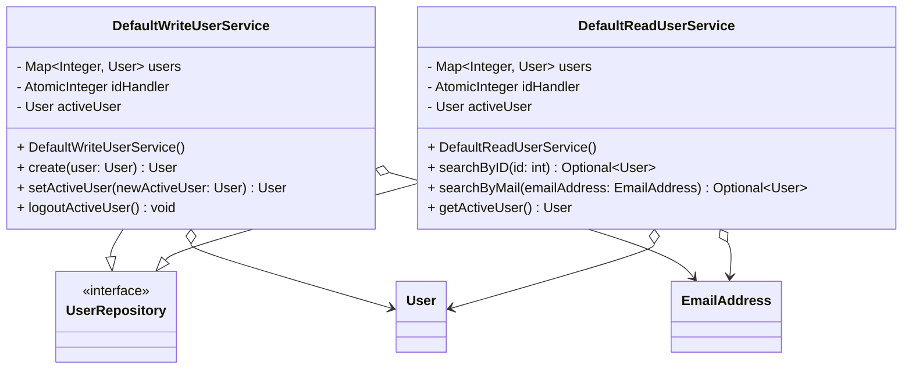
```mermaid
classDiagram
    class DefaultWriteUserService {
        - Map~Integer, User~ users
        - AtomicInteger idHandler
        - User activeUser
        + DefaultWriteUserService()
        + create(user: User) User
        + setActiveUser(newActiveUser: User) User
        + logoutActiveUser() void
    }

    class DefaultReadUserService {
        - Map~Integer, User~ users
        - AtomicInteger idHandler
        - User activeUser
        + DefaultReadUserService()
        + searchByID(id: int) Optional~User~
        + searchByMail(emailAddress: EmailAddress) Optional~User~
        + getActiveUser() User
    }

    class UserRepository {
        <<interface>>
    }

    class User
    class EmailAddress

    DefaultWriteUserService --|> UserRepository
    DefaultReadUserService --|> UserRepository

    DefaultWriteUserService o--> User
    DefaultWriteUserService o--> EmailAddress

    DefaultReadUserService o--> User
    DefaultReadUserService o--> EmailAddress


```


## 3.2 Analyse Open-Closed-Principle (OCP)

### 3.2.1 Positiv-Beispiel: `RecipeFinder`

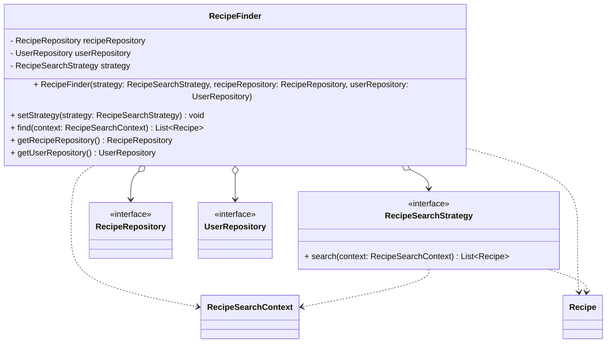
```mermaid
classDiagram
    class RecipeFinder {
        - RecipeRepository recipeRepository
        - UserRepository userRepository
        - RecipeSearchStrategy strategy
        + RecipeFinder(strategy: RecipeSearchStrategy, recipeRepository: RecipeRepository, userRepository: UserRepository)
        + setStrategy(strategy: RecipeSearchStrategy) void
        + find(context: RecipeSearchContext) List~Recipe~
        + getRecipeRepository() RecipeRepository
        + getUserRepository() UserRepository
    }

    class RecipeSearchStrategy {
        <<interface>>
        + search(context: RecipeSearchContext) List~Recipe~
    }

    class RecipeRepository {
        <<interface>>
    }
    class UserRepository {
        <<interface>>
    }

    class RecipeSearchContext
    class Recipe

    RecipeFinder o--> RecipeRepository
    RecipeFinder o--> UserRepository
    RecipeFinder o--> RecipeSearchStrategy
    RecipeFinder ..> RecipeSearchContext
    RecipeFinder ..> Recipe
    RecipeSearchStrategy ..> RecipeSearchContext
    RecipeSearchStrategy ..> Recipe

```
Die Klasse `RecipeFinder` erfüllt das OCP, da es offen für Erweiterungen ist. Neue Strategien zum Finden von Rezepten kann durch das Anlegen neuer `RecipeSearchStrategy` Klassen realisiert werden, ohne dabei die vorhandene Klasse verändern zu müssen. 


### 3.2.2 Negativ-Beispiel: `DefaultUserRepository`

```mermaid
classDiagram
    class DefaultUserRepository {
        - Map~Integer, User~ users
        - AtomicInteger idHandler
        - User activeUser
        + DefaultUserRepository()
        - mockRepository() void
        + create(user: User) User
        + searchByID(id: int) Optional~User~
        + searchByMail(emailAddress: EmailAddress) Optional~User~
        + getActiveUser() User
        + setActiveUser(newActiveUser: User) User
        + logoutActiveUser() void
    }

    class UserRepository {
        <<interface>>
    }

    class User
    class EmailAddress

    DefaultUserRepository --|> UserRepository
    DefaultUserRepository o--> User
    DefaultUserRepository o--> EmailAddress


```
Die Klasse `DefaultUserRepository` verletzt das OCP, da es nicht offen für Erweiterungen ist. Alle Logik (z.B. Speicherung, Suche, Authentifizierung) ist fest in einer Klasse implementiert. Wenn sich z.B. die Art der Speicherung (In-Memory, Datenbank, REST-Service) oder das Suchverhalten ändert, muss die Klasse geändert werden. 

**Lösungsvorschlag**:
- Extrahiere die Speicherlogik in ein Interface, z.B. UserStorage.
- Implementiere verschiedene Speicherstrategien (z.B. InMemoryUserStorage, DatabaseUserStorage).
DefaultUserRepository verwendet das Interface und ist so offen für neue Speicherarten, ohne selbst geändert werden zu müssen.

UML:
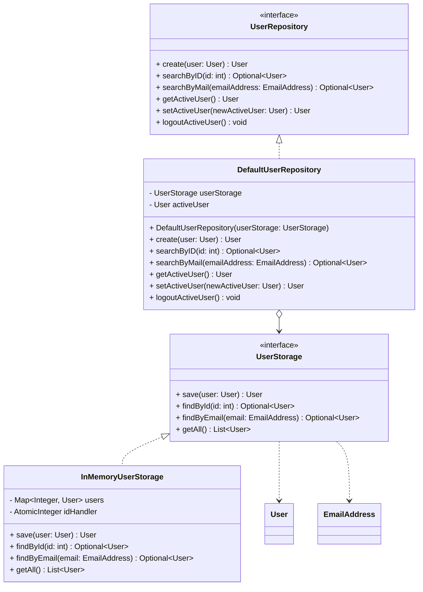
```mermaid
classDiagram
    class UserRepository {
        <<interface>>
        + create(user: User) User
        + searchByID(id: int) Optional~User~
        + searchByMail(emailAddress: EmailAddress) Optional~User~
        + getActiveUser() User
        + setActiveUser(newActiveUser: User) User
        + logoutActiveUser() void
    }

    class DefaultUserRepository {
        - UserStorage userStorage
        - User activeUser
        + DefaultUserRepository(userStorage: UserStorage)
        + create(user: User) User
        + searchByID(id: int) Optional~User~
        + searchByMail(emailAddress: EmailAddress) Optional~User~
        + getActiveUser() User
        + setActiveUser(newActiveUser: User) User
        + logoutActiveUser() void
    }

    class UserStorage {
        <<interface>>
        + save(user: User) User
        + findById(id: int) Optional~User~
        + findByEmail(email: EmailAddress) Optional~User~
        + getAll() List~User~
    }

    class InMemoryUserStorage {
        - Map~Integer, User~ users
        - AtomicInteger idHandler
        + save(user: User) User
        + findById(id: int) Optional~User~
        + findByEmail(email: EmailAddress) Optional~User~
        + getAll() List~User~
    }

    class User
    class EmailAddress

    UserRepository <|.. DefaultUserRepository
    DefaultUserRepository o--> UserStorage
    UserStorage <|.. InMemoryUserStorage
    UserStorage ..> User
    UserStorage ..> EmailAddress

```


## 3.3 Analyse Interface-Segregation-Principle (ISP)

### 3.3.1 Positiv-Beispiel: `LoginUser`und `LogoutUser`
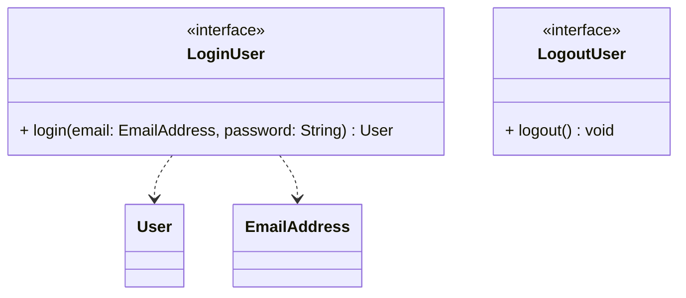
```mermaid
classDiagram
    class LoginUser {
        <<interface>>
        + login(email: EmailAddress, password: String) User
    }

    class User
    class EmailAddress

    LoginUser ..> User
    LoginUser ..> EmailAddress

    class LogoutUser {
        <<interface>>
        + logout() void
    }
```


Die beiden Interfaces `LoginUser` und `LogoutUser` erf+llen das ISP, da beide nach Funktionalität aufgeteilt sind. Daher müssen Klassen, die die Interfaces konsumieren, keine unnötigen Funktionen implementieren.


### 3.3.2 Negativ-Beispiel: `RecipeRepository`

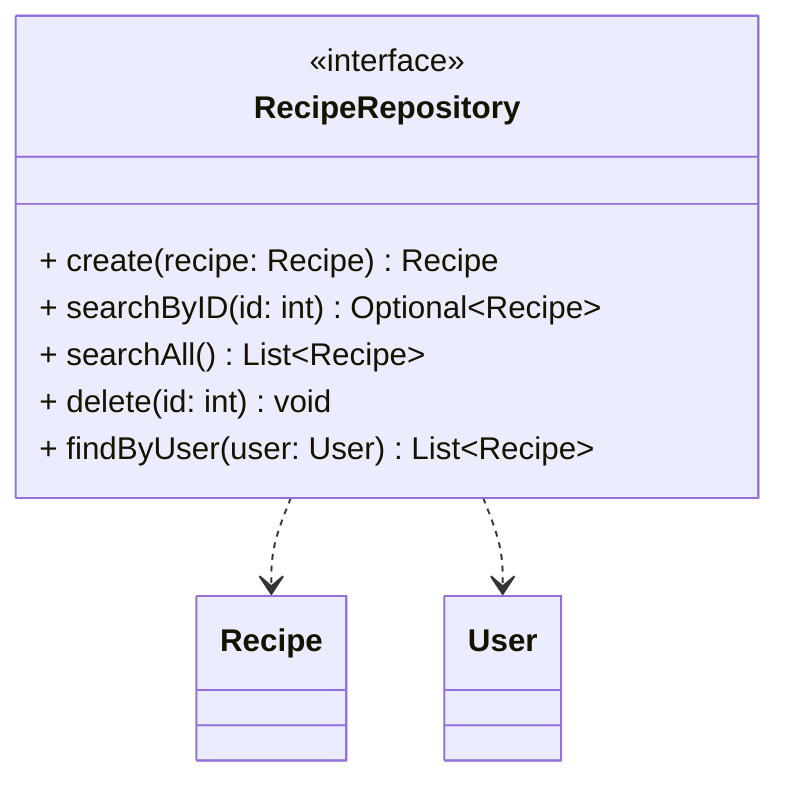
```mermaid
classDiagram
    class RecipeRepository {
        <<interface>>
        + create(recipe: Recipe) Recipe
        + searchByID(id: int) Optional~Recipe~
        + searchAll() List~Recipe~
        + delete(id: int) void
        + findByUser(user: User) List~Recipe~
    }

    class Recipe
    class User

    RecipeRepository ..> Recipe
    RecipeRepository ..> User

```

Das Interface `RecipeRepository` verletzt das ISP, da es viele verschiedene Funktionen definiert, die implementierende Klassen eventuell nicht benötigen. Möchte eine Klasse z.B. lediglich Rezepte lesen, muss sie wegen des Interaces auch schreibende Methoden implementieren.

Mögliche Lösung:
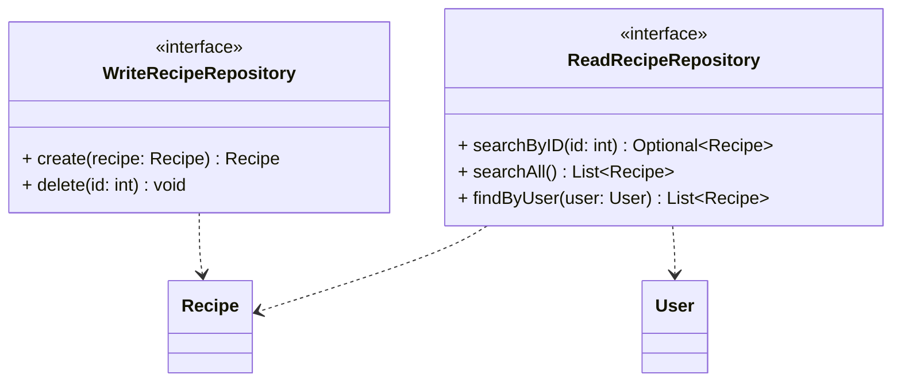
```mermaid
classDiagram
    class WriteRecipeRepository {
        <<interface>>
        + create(recipe: Recipe) Recipe
        + delete(id: int) void
    }

    class ReadRecipeRepository {
        <<interface>>
        + searchByID(id: int) Optional~Recipe~
        + searchAll() List~Recipe~
        + findByUser(user: User) List~Recipe~
    }

    class Recipe
    class User

    WriteRecipeRepository ..> Recipe
    ReadRecipeRepository ..> Recipe
    ReadRecipeRepository ..> User

```

Durch diese Aufteilung sind Klassen nicht gezwungen, unnötige Methoden zu implementieren, die sie nicht benötigen.

# 4. Weitere Prinzipien
## 4.1 Analyse GRASP: Geringe Kopplung

### 4.1.1 Positives-Beispiel: `DefaultEditRecipe`

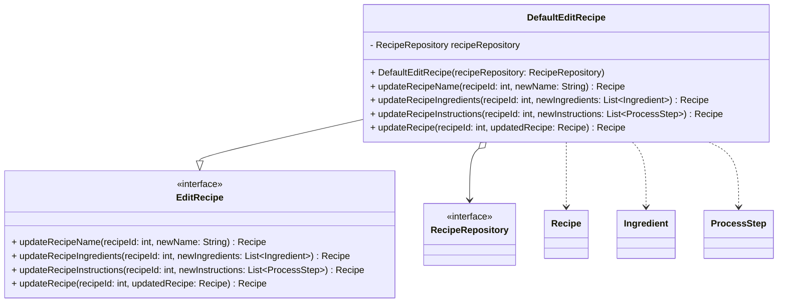
```mermaid
classDiagram
    class DefaultEditRecipe {
        - RecipeRepository recipeRepository
        + DefaultEditRecipe(recipeRepository: RecipeRepository)
        + updateRecipeName(recipeId: int, newName: String) Recipe
        + updateRecipeIngredients(recipeId: int, newIngredients: List~Ingredient~) Recipe
        + updateRecipeInstructions(recipeId: int, newInstructions: List~ProcessStep~) Recipe
        + updateRecipe(recipeId: int, updatedRecipe: Recipe) Recipe
    }

    class EditRecipe {
        <<interface>>
        + updateRecipeName(recipeId: int, newName: String) Recipe
        + updateRecipeIngredients(recipeId: int, newIngredients: List~Ingredient~) Recipe
        + updateRecipeInstructions(recipeId: int, newInstructions: List~ProcessStep~) Recipe
        + updateRecipe(recipeId: int, updatedRecipe: Recipe) Recipe
    }

    class RecipeRepository {
        <<interface>>
    }
    class Recipe
    class Ingredient
    class ProcessStep

    DefaultEditRecipe --|> EditRecipe
    DefaultEditRecipe o--> RecipeRepository
    DefaultEditRecipe ..> Recipe
    DefaultEditRecipe ..> Ingredient
    DefaultEditRecipe ..> ProcessStep

```
Die Klasse `DefaultEditRecipe` weist eine geringe Kopplung auf, da sie von den Interface `EditRecipe` und `RecipeRepository` abhängt und nicht von einer konkreten Implementierung. Dadurch wird die Klasse flexibler und kann besser getestet werden. Zudem bringen Änderungen der konkreten Implementierungen vom Interface `RecipeRepository` keine direkten Änderungen in der Klasse `DefaultEditRecipe` mit sich, da direkte Abhängigkeiten reduziert wurden. 

### 4.1.2 Negatives-Beispiel: `DefaultGetShoppingList`

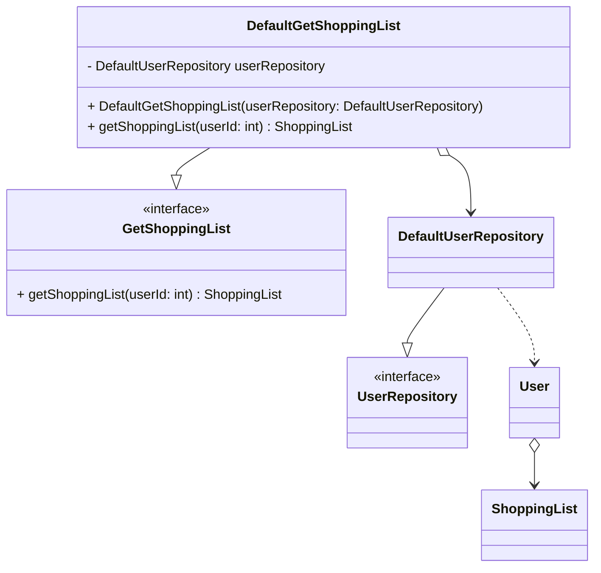
```mermaid
classDiagram
    class DefaultGetShoppingList {
        - DefaultUserRepository userRepository
        + DefaultGetShoppingList(userRepository: DefaultUserRepository)
        + getShoppingList(userId: int) ShoppingList
    }

    class GetShoppingList {
        <<interface>>
        + getShoppingList(userId: int) ShoppingList
    }

    class DefaultUserRepository
    class UserRepository {
        <<interface>>
    }
    class User
    class ShoppingList

    DefaultGetShoppingList --|> GetShoppingList
    DefaultGetShoppingList o--> DefaultUserRepository
    DefaultUserRepository --|> UserRepository
    DefaultUserRepository ..> User
    User o--> ShoppingList

```

Die Klasse `DefaultGetShoppingList` weist eine hohe Kopplung auf, da sie direkt von der konkreten Implementierung `DefaultUserRepository` abhängt. Dies erschwert das Testen, da Änderungen in der konkreten Implementierung auch Änderungen in der Klasse `DefaultGetShoppingList` mit sich bringen kann. Die Kopplung kann aufgehoben werden, indem die Klasse lediglich von dem Interface `UserRepository` abhängt, und nicht von einer konkreten Implementierung.

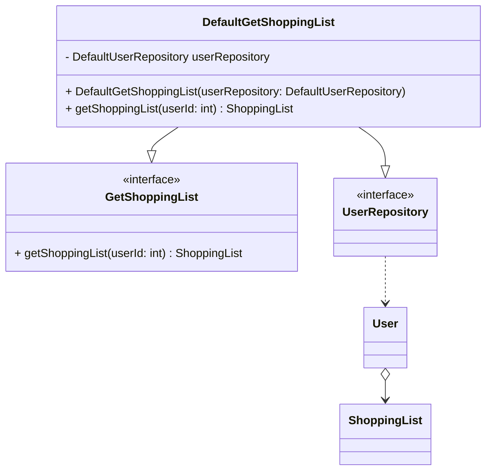
```mermaid
classDiagram
    class DefaultGetShoppingList {
        - DefaultUserRepository userRepository
        + DefaultGetShoppingList(userRepository: DefaultUserRepository)
        + getShoppingList(userId: int) ShoppingList
    }

    class GetShoppingList {
        <<interface>>
        + getShoppingList(userId: int) ShoppingList
    }

    class UserRepository {
        <<interface>>
    }
    class User
    class ShoppingList

    DefaultGetShoppingList --|> GetShoppingList
    DefaultGetShoppingList --|> UserRepository
    UserRepository ..> User
    User o--> ShoppingList

```

## 4.2 Analyse GRASP: Hohe Kohäsion

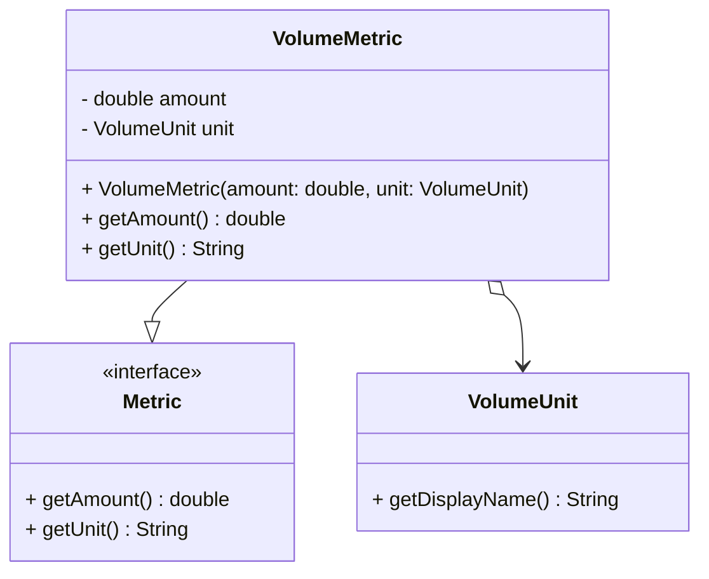
```mermaid
classDiagram
    class VolumeMetric {
        - double amount
        - VolumeUnit unit
        + VolumeMetric(amount: double, unit: VolumeUnit)
        + getAmount() double
        + getUnit() String
    }

    class Metric {
        <<interface>>
        + getAmount() double
        + getUnit() String
    }

    class VolumeUnit {
        + getDisplayName() String
    }

    VolumeMetric --|> Metric
    VolumeMetric o--> VolumeUnit

```

**Begründung:**
Die Klasse VolumeMetric weist eine hohe Kohäsion auf, da alle Attribute und Methoden semantisch eng miteinander verbunden sind und sich auf die Verwaltung einer Volumeneinheit konzentrieren. Die Attribute amount und unit beschreiben die wesentlichen Eigenschaften einer Volumenangabe. Die Methoden der Klasse (getAmount, getUnit) arbeiten direkt mit diesen Attributen und bieten eine klare und verständliche Schnittstelle zur Abfrage der Volumen-Metrik.

**Vorteile hoher Kohäsion:**
Die Klasse VolumeMetric hat ein einfaches und verständliches Design, da sie sich auf eine einzige Verantwortlichkeit konzentriert: die Verwaltung einer Volumenangabe mit Einheit. Durch die klare Trennung der Verantwortlichkeiten und die enge semantische Verbindung der Attribute und Methoden kann die Klasse VolumeMetric in verschiedenen Kontexten wiederverwendet werden, ohne dass Änderungen erforderlich sind.

**Technische Metriken:**
Die Klasse VolumeMetric hat eine überschaubare Anzahl von Attributen und Methoden, was zur Übersichtlichkeit beiträgt. Die Methoden der Klasse nutzen die Attribute intensiv, was auf eine hohe Kohäsion hinweist.
## 4.3 Don’t Repeat Yourself (DRY)

Hash des commits: 8d7ba47f5f97806fe5ccdd97f95ee15bbf81bd1c

Vorher:
```java
private int getIntInput(String output) {
        while (true) {
            try {
                System.out.print(output);
                return Integer.parseInt(scanner.nextLine().trim());
            } catch (NumberFormatException e) {
                System.out.println("Invalid input. Please enter a number.");
            }
        }
    }

int choice = getIntInput("Choose an option: ");
```
Dieser Code war vorher auf Adapter Ebene in den Klassen `ConsoleAdapter`, `ManageUserHandler`, `RecipeHandler` und `ShoppingListHandler` separat als eigenstände Methode. Da die Methode überall dasselbe macht, nämlich den Input des Users als integer Wert zurückzugeben, haben wir diese in eine static Methode in die Klasse `InputUtils` verlagert.

Usage nachher:
```java
public class InputUtils {
    public static int getIntInput(String output, Scanner scanner) {
        while (true) {
            try {
                System.out.print(output);
                return Integer.parseInt(scanner.nextLine().trim());
            } catch (NumberFormatException e) {
                System.out.println("Invalid input. Please enter a number.");
            }
        }
    }
}

int choice = InputUtils.getIntInput("Choose an option: ", scanner);
```
Begründung und Auswirkung:
Die Logik zum abfangen von Konsolen Input ist in allen Klassen gleich. Sollte im Laufe der Entwicklung bei der Logik Änderungen vorgenommen werden müssen, müssen diese jetzt nur noch zentral in der statischen Methode verändert werden, und nicht mehr in jeder Klasse einzelnd.

# 5. Unit Tests
## 5.1 Zehn Unit Tests - Tabelle

| Klasse                                | Test                         | Beschreibung                |
| ------------------------------------- | ---------------------------- | ----------------------------|
| EmailAddressTest                      | createValidAddress           | Testet, ob eine gültige E-Mail-Adresse korrekt erstellt wird und die Adresse wie erwartet zurückgegeben wird.
|                                       | createInvalidAddress         | Testet, ob beim Erstellen einer ungültigen E-Mail-Adresse eine `InvalidEmailAddressException` ausgelöst wird.
|                                       | returnDomain                 | Testet, ob die Methode zur Rückgabe der Domain einer E-Mail-Adresse den korrekten Domain-Teil liefert.
|                                       | validateEquality             | Testet, ob zwei EmailAddress-Objekte mit identischer Adresse als gleich betrachtet werden.
| DefaultLoginUserTest                  | testLoginSuccessful          | Testet, ob ein Benutzer mit korrekten Zugangsdaten erfolgreich eingeloggt wird und der zurückgegebene Benutzer dem erwarteten Benutzer entspricht.
|                                       | testLoginUserNotFound        | Testet, ob beim Login-Versuch mit einer nicht existierenden E-Mail-Adresse eine `UserNotFoundException` mit der korrekten Fehlermeldung geworfen wird.
|                                       | testLoginInvalidPassword     | Testet, ob beim Login-Versuch mit falschem Passwort eine `InvalidPasswordException` mit der korrekten Fehlermeldung geworfen wird.
| DefaultRemoveItemFromShoppingListTest | removeItemSuccessful         | Testet, ob ein vorhandenes Ingredient erfolgreich aus der Einkaufsliste eines existierenden Benutzers entfernt wird.
|                                       | removeItemUserNotFound       | Testet, ob beim Versuch, ein Ingredient aus der Einkaufsliste eines nicht existierenden Benutzers zu entfernen, eine `UserNotFoundException` mit der korrekten Fehlermeldung geworfen wird.
|                                       | removeItemIngredientNotFound | Testet, ob beim Versuch, ein nicht vorhandenes Ingredient aus der Einkaufsliste zu entfernen, eine `IngredientNotFoundException` mit der korrekten Fehlermeldung geworfen wird.

## 5.2 ATRIP
### 5.2.1 ATRIP: Automatic

Bei Maven Projekten wird durch das `maven-surefire-plugin` JUnit Tests automatisch während der Testphase ausgeführt. Dadurch werden alle Tests automatisch im Entwicklungsprozess ausgeführt.


### 5.2.2 ATRIP: Thorough
#### 5.2.2.1 Positiv-Beispiel
```java 
@Test
void removeItemSuccessful() {

    Metric metric = new VolumeMetric(10, VolumeUnit.LITER);
    String ingredientName = "Tomato";
    Ingredient ingredient = new Ingredient(0, metric, ingredientName, IngredientCategory.BEVERAGES);

    ShoppingList shoppingList = user.getShoppingList();
    List<Ingredient> ingredients = new ArrayList<>(shoppingList.getIngredients());
    ingredients.add(ingredient);
    shoppingList.setIngredients(ingredients);

    Mockito.when(userRepository.searchByID(1)).thenReturn(Optional.of(user));

    ShoppingList result = removeItemFromShoppingList.removeItem(1, ingredientName);

    assertNotNull(result);
    assertFalse(result.getIngredients().stream()
                    .anyMatch(ing -> ing.getName().equals(ingredientName)),
            "Ingredient should have been removed from the shopping list.");
}
```


Die Testmethode „removeItemSuccessful“ entspricht dem ATRIP-Prinzip „Thorough“, weil sie den vollständigen Ablauf des Entfernens eines Ingredients aus der Einkaufsliste eines Benutzers prüft. Sie stellt sicher, dass das Ingredient tatsächlich in der Liste vorhanden ist, bevor es entfernt wird, und überprüft anschließend explizit, dass das Ingredient nach der Operation nicht mehr in der Liste enthalten ist. Durch die Verwendung von Mocking für das Repository wird sichergestellt, dass der Benutzer korrekt gefunden und verwendet wird, wodurch externe Einflüsse ausgeschlossen werden. Außerdem wird nicht nur das Ergebnisobjekt auf null geprüft, sondern auch der konkrete Zustand der Einkaufsliste nach der Operation, was eine gründliche Überprüfung des Verhaltens garantiert.
#### 5.2.2.2 Positiv-Beispiel
```java
@Test
void removeItemIngredientNotFound() {

    Mockito.when(userRepository.searchByID(1)).thenReturn(Optional.of(user));

    ShoppingList shoppingList = user.getShoppingList();
    shoppingList.setIngredients(new ArrayList<>()); // Ensuring empty list

    Exception exception = assertThrows(IngredientNotFoundException.class, () -> {
        removeItemFromShoppingList.removeItem(1, "NonExistingIngredient");
    });
    assertEquals("Ingredient NonExistingIngredient not found!", exception.getMessage());
}
```
Die Testmethode „removeItemIngredientNotFound“ ist thorough, weil sie gezielt den Fall prüft, dass ein zu entfernendes Ingredient nicht in der Einkaufsliste vorhanden ist. Sie sorgt dafür, dass die Einkaufsliste vor dem Test explizit leer ist, um sicherzustellen, dass der Fehlerfall eindeutig ausgelöst wird. Der Test überprüft nicht nur, dass eine IngredientNotFoundException geworfen wird, sondern auch, dass die Fehlermeldung exakt dem erwarteten Text entspricht. Damit wird sichergestellt, dass sowohl die Fehlererkennung als auch die Fehlerkommunikation im System gründlich und korrekt funktionieren.


### 5.2.3 ATRIP: Professional

#### 5.2.3.1 Positiv-Beispiel
Folgender Test befindet sich in der Klasse `DefaultChangeUserNameTest`
```java 
@Test
void changeNameSuccessful() {
    User user = new User.Builder().id(1).email(new EmailAddress("test@mail.de")).userName("OldName").password("pw").build();

    Mockito.when(userRepository.searchByID(1)).thenReturn(Optional.of(user));

    User updatedUser = changeUserName.changeName(1, "NewName");

    assertNotNull(updatedUser);
    assertEquals("NewName", updatedUser.getUserName());
    Mockito.verify(userRepository, Mockito.times(1)).searchByID(1);
}
```
Der Test ist professionell, weil er klar und verständlich aufgebaut ist, sprechende Namen verwendet und die Testumgebung mit Mockito sauber isoliert. Er prüft gezielt das gewünschte Verhalten und die Interaktion mit dem Repository. Die Assertions sind präzise und nachvollziehbar, was die Wartbarkeit und Zuverlässigkeit des Tests erhöht.


#### 5.2.3.2 Negativ-Beispiel
Folgender Test befindet sich in der Klasse `DefaultAddItemToShoppingListTest`
```java
@Test
void addItemSuccessful() {
    Metric metric = new VolumeMetric(10, VolumeUnit.LITER);
    Ingredient ingredient = new Ingredient(0, metric, "Tomato", IngredientCategory.BEVERAGES);
    Mockito.when(userRepository.searchByID(1)).thenReturn(Optional.of(user));

    ShoppingList result = addItemToShoppingList.addItem(1, ingredient);

    assertNotNull(result);
    assertTrue(result.getIngredients().contains(ingredient));
    Mockito.verify(userRepository, Mockito.times(1)).searchByID(1);
}
``` 
Der Test ist nicht professionell, da das metric und ingredient Objekt manuell erstellt wird. Bei Änderungen in den entsprechenden Klassen muss auch die Testklasse angepasst werden, was nicht dem Prinzip entspricht.

## 5.3 Code Coverage

In diesem Projekt nutzen wir JaCoCo zur Messung der Code Coverage. Eine hohe Abdeckung deutet darauf hin, dass ein Großteil des Codes durch automatisierte Tests geprüft wird, was potenziell die Fehlerrate senkt.

Wichtig ist: Eine hohe Code Coverage bedeutet nicht automatisch Fehlerfreiheit. Fehlende oder falsch formulierte Assertions können dazu führen, dass existierende Fehler unentdeckt bleiben.

Um die Zuverlässigkeit des Codes sicherzustellen, sind sowohl positive Tests (Überprüfung des korrekten Verhaltens) als auch negative Tests (Prüfung der Fehlerbehandlung) unerlässlich.

**Analyse und Begründung:**
Der Fokus lag bei uns auf das Testen der Application layer, da dort die eigentliche Geschäftslogik liegt. Es wurden lediglich Unit Tests geschrieben, die isoliert die Logik testen sollen. Jedoch muss zugegeben werden, dass die Code Coverage selbst auf Application layer deutlich zu niedrig ist. In Zukunft sollte mindestens 80% Code Coverage mit sinnvollen tests erreicht werden. Zudem können Integrationstest hinzugefügt werden. Auf Domain Schicht wurde lediglich das value Object `EmailAddress` getestet.

Domain Schicht:
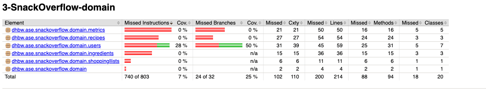

Application Schicht:
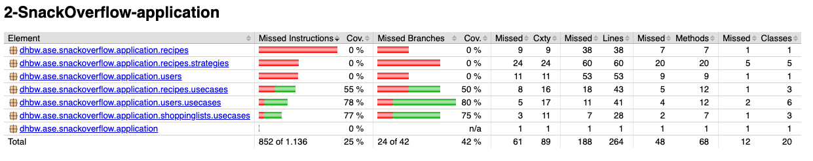

## 5.4 Fakes und Mocks

### 5.4.1 Mock-Objekt: `DefaultUserRepository`
In mehreren Tests wird das `DefaultUserRepository` Objekt gemockt, um die Geschäftslogik zu trennen und die Testmethoden isoliert testen zu können.

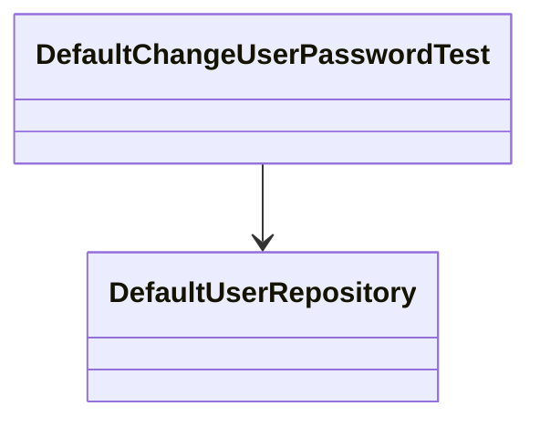
```mermaid
classDiagram
    class DefaultChangeUserPasswordTest 

    class DefaultUserRepository
    

    DefaultChangeUserPasswordTest --> DefaultUserRepository

```

Beispiel-Code:
```java
private DefaultUserRepository userRepository = Mockito.mock(DefaultUserRepository.class);
private DefaultChangeUserPassword changeUserPassword = new DefaultChangeUserPassword(userRepository);

@Test
void changePasswordSuccessful() {
    User user = new User.Builder()
            .id(1)
            .email(new EmailAddress("test@mail.de"))
            .userName("name")
            .password("oldPw")
            .build();
    Mockito.when(userRepository.searchByID(1)).thenReturn(Optional.of(user));

    User updatedUser = changeUserPassword.changePassword(1, "newPw");

    assertNotNull(updatedUser);
    assertEquals("newPw", updatedUser.getPassword());
    Mockito.verify(userRepository, Mockito.times(1)).searchByID(1);
}
```
**Analyse und Begründung:**
In der Testklasse `DefaultChangeUserPasswordTest` wird das Mock-Objekt `DefaultUserRepository` verwendet, um das Verhalten des echten Repositories zu simulieren, ohne auf eine echte Datenbank oder eine konkrete Implementierung zugreifen zu müssen. Das Mock-Objekt wird mit Hilfe von Mockito erstellt.
Der Einsatz des Mock-Objekts `DefaultUserRepository` ermöglicht es, die Logik der Klasse `DefaultChangeUserPassword` isoliert, effizient und zuverlässig zu testen, was zu robusteren und wartbareren Tests führt.

### 5.4.2 Mock-Objekt: `DefaultRecipeRepository`
In mehreren Tests wird das `DefaultRecipeRepository` Objekt gemockt, um die Geschäftslogik zu trennen und die Testmethoden isoliert testen zu können.

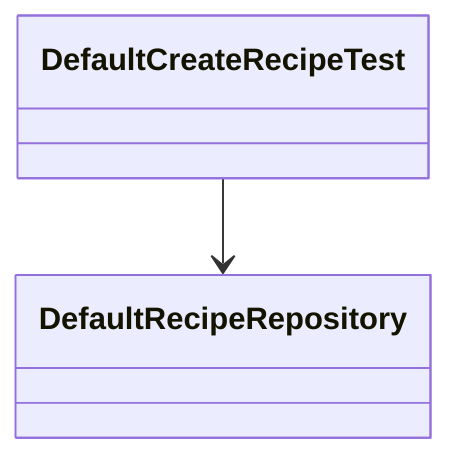
```mermaid
classDiagram
    class DefaultCreateRecipeTest 

    class DefaultRecipeRepository
    

    DefaultCreateRecipeTest --> DefaultRecipeRepository


```
Beispiel-Code:
```java
@BeforeEach
void setUp() {
    recipeRepository = Mockito.mock(DefaultRecipeRepository.class);
    userRepository = Mockito.mock(DefaultUserRepository.class);
    defaultCreateRecipe = new DefaultCreateRecipe(recipeRepository, userRepository);
    creator = new User.Builder().id(0).email(new EmailAddress("til@til.de")).userName("Til").password("1234").build();

}

@Test
void testCreateRecipeSuccessfully() {
    Recipe recipe = new Recipe(0, "Pasta", 4, 45, new ArrayList<ProcessStep>(), creator);
    Mockito.when(userRepository.searchByID(creator.getId())).thenReturn(Optional.of(creator));
    Mockito.when(recipeRepository.create(recipe)).thenReturn(recipe);

    Recipe createdRecipe = defaultCreateRecipe.createRecipe(recipe);

    Mockito.verify(userRepository).searchByID(creator.getId());
    Mockito.verify(recipeRepository).create(recipe);
    assertEquals(recipe, createdRecipe);
}
```
**Analyse und Begründung:**
In der Testklasse `DefaultCreateRecipeTest` wird das Mock-Objekt `DefaultRecipeRepository` verwendet, um das Verhalten des echten Repositories zu simulieren, ohne auf eine echte Datenbank oder eine konkrete Implementierung zugreifen zu müssen. Das Mock-Objekt wird mit Hilfe von Mockito erstellt.
Der Einsatz des Mock-Objekts `DefaultRecipeRepository` ermöglicht es, die Logik der Klasse `DefaultCreateRecipe` isoliert, effizient und zuverlässig zu testen, was zu robusteren und wartbareren Tests führt.

# 6. Domain-Driven-Design (DDD)
## 6.1 Ubiquitous Language
| Bezeichnung    | Bedeutung                                                    | Begründung                                                                                                |
| -------------- | ------------------------------------------------------------ | --------------------------------------------------------------------------------------------------------- |
| User           | Nutzer, die Anwendung verwendet                              | "User" (oder "Nutzer") ist der allgemein verständliche Begriff für eine Person, die Software bedient. Es ist klar und eindeutig. |
| Recipe         | Ein Rezept mit mehreren Schritten und Zutaten zum Kochen      | "Recipe" (oder "Rezept") ist der etablierte und allgemein bekannte Begriff für eine Kochanleitung. Es beschreibt präzise den Kerninhalt. |
| Ingredient     | Eine Zutat, die Teil eines Rezeptes sein kann (oder ShoppingList) | "Ingredient" (oder "Zutat") ist der Standardbegriff für Bestandteile eines Rezepts. Es ist spezifisch und wird von allen Nutzern verstanden. |
| ShoppingList   | Eine Liste an Zutaten, die eingekauft werden müssen          | "ShoppingList" (oder "Einkaufsliste") beschreibt eindeutig den Zweck, nämlich eine Liste von zu kaufenden Dingen. Im Kontext der Anwendung sind dies primär Zutaten. |           
## 6.2 Entities - User Entity

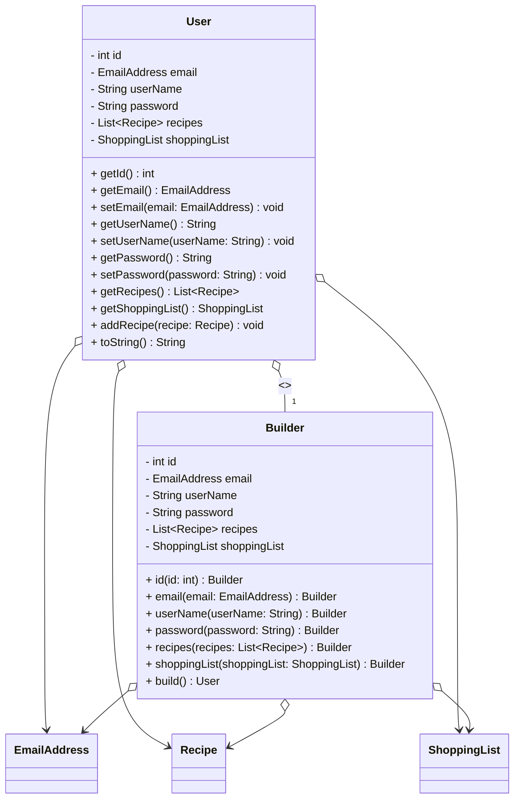
```mermaid
classDiagram
    class User {
        - int id
        - EmailAddress email
        - String userName
        - String password
        - List~Recipe~ recipes
        - ShoppingList shoppingList
        + getId() int
        + getEmail() EmailAddress
        + setEmail(email: EmailAddress) void
        + getUserName() String
        + setUserName(userName: String) void
        + getPassword() String
        + setPassword(password: String) void
        + getRecipes() List~Recipe~
        + getShoppingList() ShoppingList
        + addRecipe(recipe: Recipe) void
        + toString() String
    }

    class Builder {
        - int id
        - EmailAddress email
        - String userName
        - String password
        - List~Recipe~ recipes
        - ShoppingList shoppingList
        + id(id: int) Builder
        + email(email: EmailAddress) Builder
        + userName(userName: String) Builder
        + password(password: String) Builder
        + recipes(recipes: List~Recipe~) Builder
        + shoppingList(shoppingList: ShoppingList) Builder
        + build() User
    }

    class EmailAddress
    class Recipe
    class ShoppingList

    User o-- "1" Builder : <<static>>
    User o--> EmailAddress
    User o--> Recipe
    User o--> ShoppingList
    Builder o--> EmailAddress
    Builder o--> Recipe
    Builder o--> ShoppingList

```
**Beschreibung:**
Die Klasse User beschreibt einen Nutzer der Anwendung, der mit Rezepten interagieren kann und zusätzlich eine Einkaufsliste modelliert.

**Begründung:**
Der Einsatz eines Entities ist hier sinnvoll, weil:

1. Identität: Jeder Benutzer wird durch eine eindeutige ID identifiziert, unabhängig von seinen Attributwerten.
2. Zustandsänderung: Die Klasse erlaubt Änderungen an ihren Attributen (z.B. Rezepte hinzufügen, Passwort ändern), was typisch für Entities ist.
3. Domänenlogik: Die Klasse kann domänenspezifische Logik enthalten, z.B. das Hinzufügen von Rezepten.
4. Wiederverwendbarkeit: Entities sind zentrale Bausteine im Domain-Driven Design und können in verschiedenen Kontexten (z.B. Authentifizierung, Rezeptverwaltung) wiederverwendet werden.

## 6.3 Value Objects - EmailAdress Object
```mermaid
classDiagram
  class EmailAddress {
    -final String address
    +EmailAddress(String address)
    +getAddress() String
    +getDomain() String
    -isValid(String address) boolean
    +equals(Object o) boolean
    +hashCode() int
    +toString() String
  }
```
**Beschreibung:**
Die Klasse `EmailAddress` repräsentiert eine E-Mail Adresse mit der sich Nutzer in der Anwendung registrieren und anmelden können.

**Begründung, warum `EmailAddress` ein Value Object ist:**
Die Klasse EmailAddress erfüllt die Kriterien eines Value Objects aus folgenden Gründen:

1. Identität basiert auf Wert: Die equals()- und hashCode()-Methoden basieren ausschließlich auf dem Wert des address-Strings. Zwei EmailAddress-Instanzen sind gleich, wenn ihre E-Mail-Adressen-Strings (nach Konvertierung in Kleinbuchstaben) identisch sind, unabhängig von ihrer Speicheradresse.
2. Immutabilität: Das Attribut address ist final und wird im Konstruktor gesetzt. Es gibt keine Methoden, um den Zustand des Objekts nach der Erstellung zu ändern. Die Klasse selbst ist ebenfalls final, was die Immutabilität weiter unterstützt, da keine Unterklassen das Verhalten ändern können.
3. Selbstvalidierung: Der Konstruktor stellt sicher, dass nur gültige E-Mail-Adressen (gemäß der isValid-Methode) zur Erstellung eines Objekts führen. Dies schützt die Integrität des Werts.
4. Keine eigene ID: Das Objekt hat keine separate ID oder einen Lebenszyklus, der über den Wert seiner Attribute hinausgeht. Es repräsentiert lediglich den Wert einer E-Mail-Adresse.

## 6.4 Aggregates - Recipe Aggregate
```mermaid
classDiagram
    class Recipe {
        - int id
        - String name
        - int portions
        - int preparationTime
        - List~Ingredient~ ingredients
        - List~ProcessStep~ processSteps
        - User creator
        + Recipe(id: int, name: String, portions: int, preparationTime: int, processSteps: List~ProcessStep~, creator: User)
        + getCreator() User
        + setCreator(creator: User) void
        + getId() int
        + setId(id: int) void
        + getName() String
        + setName(name: String) void
        + getPortions() int
        + setPortions(portions: int) void
        + getPreparationTime() int
        + setPreparationTime(preparationTime: int) void
        + getIngredients() List~Ingredient~
        + setIngredients(ingredients: List~Ingredient~) void
        + getProcessSteps() List~ProcessStep~
        + setProcessSteps(processSteps: List~ProcessStep~) void
        + toString() String
    }

    class Ingredient
    class ProcessStep
    class User

    Recipe o--> Ingredient
    Recipe o--> ProcessStep
    Recipe o--> User

```

**Beschreibung:**
Die Klase `Recipe` repräsentiert Rezepte mit veschiedenen Zutaten und Verarbeitungsschritte. User können diese erstellen, bearbeiten und sich diese anzeigen lassen.

**Begründung:**
Die Klasse `Recipe` kann als Aggregat betrachtet werden, wobei Recipe selbst das Aggregate Root ist:

1. Identität und Wurzel: Recipe ist eine Entität, da sie eine eindeutige id besitzt und einen eigenen Lebenszyklus hat (sie kann erstellt, geändert, gelöscht werden). Sie dient als primärer Zugriffspunkt für das gesamte Konzept eines Rezepts.
2. Grenze und Kapselung: Recipe fasst andere Objekte wie ProcessStep und Ingredient logisch zusammen. Diese Objekte sind für die Definition eines Rezepts wesentlich und bilden zusammen eine konzeptionelle Einheit. Obwohl Ingredient und User auch eigenständige Entitäten sein können, werden sie hier im Kontext des Rezepts referenziert und teilweise verwaltet (die ingredients-Liste wird im Konstruktor basierend auf den processSteps aufgebaut).
3. Integrität und Invarianten: Das Aggregate Root (Recipe) ist dafür verantwortlich, die Konsistenz und die Geschäftsregeln (Invarianten) innerhalb seiner Grenzen sicherzustellen. Zum Beispiel stellt der Konstruktor sicher, dass die ingredients-Liste alle in den processSteps benötigten Zutaten enthält. 
4. Transaktionskonsistenz: Operationen wie das Speichern oder Laden eines Rezepts sollten das gesamte Aggregat (Recipe mit seinen Steps und Ingredients) als atomare Einheit behandeln. Man lädt oder speichert nicht nur einen einzelnen ProcessStep losgelöst von seinem Recipe.

## 6.5 Repositories - Customer Repository
```mermaid 
classDiagram
    class UserRepository {
        <<interface>>
        + create(user: User) User
        + searchByID(id: int) Optional~User~
        + searchByMail(emailAddress: EmailAddress) Optional~User~
        + getActiveUser() User
        + setActiveUser(newActiveUser: User) User
        + logoutActiveUser() void
    }

    class User
    class EmailAddress

    UserRepository ..> User
    UserRepository ..> EmailAddress

```
**Beschreibung:**
Das Repository `UserRepository` verwaltet das Speichern von allen User Objekten und fasst die logik dafür zusammen.

**Begründung:** 
1. Trennung von Domäne und Persistenz: Das Repository abstrahiert die Details der Datenhaltung (z.B. Datenbank, In-Memory, Datei) und bietet eine domänenspezifische Schnittstelle für den Zugriff auf Benutzerobjekte.
2. Zentrale Zugriffsstelle: Es dient als zentrale Anlaufstelle für das Laden, Speichern und Suchen von Benutzern, ohne dass die Domänenschicht wissen muss, wie und wo die Daten gespeichert sind.
3. Kapselung der Sammlung: Das Repository verhält sich wie eine Sammlung von User-Objekten, auf die über domänenspezifische Methoden zugegriffen werden kann (z.B. Suche nach ID oder E-Mail).
4. Förderung von Testbarkeit und Flexibilität: Durch die Verwendung eines Interfaces kann die Implementierung leicht ausgetauscht oder gemockt werden, was die Testbarkeit und Flexibilität erhöht.


# 7. Refactoring
## 7.1 Code Smells

### 7.1.1 Long Method
Die Methode befindet sich in der Klasse `DefaultRemoveItemFromShoppingList`. Sie ist zu lang und hat zu viele Verantwortlichkeiten.
```java
@Override
public ShoppingList removeItem(int userId, String name) {
    Optional<User> user = userRepository.searchByID(userId);
    if(!user.isPresent()) {
        throw new UserNotFoundException("User not found");
    }
    ShoppingList shoppingList = user.get().getShoppingList();
    List<Ingredient> ingredientList = shoppingList.getIngredients();
    boolean removed = ingredientList.removeIf(ingredient -> ingredient.getName().equals(name));
    if(!removed) {
        throw new IngredientNotFoundException("Ingredient " + name + " not found!");
    }
    shoppingList.setIngredients(ingredientList);

    return shoppingList;

}
```

Mögliche Lösung:
```java
@Override
public ShoppingList removeItem(int userId, String name) {
    User user = findUserOrThrow(userId);
    ShoppingList shoppingList = user.getShoppingList();
    removeIngredientOrThrow(shoppingList, name);
    return shoppingList;
}

private User findUserOrThrow(int userId) {
    return userRepository.searchByID(userId)
        .orElseThrow(() -> new UserNotFoundException("User not found"));
}

private void removeIngredientOrThrow(ShoppingList shoppingList, String name) {
    List<Ingredient> ingredientList = shoppingList.getIngredients();
    boolean removed = ingredientList.removeIf(ingredient -> ingredient.getName().equals(name));
    if (!removed) {
        throw new IngredientNotFoundException("Ingredient " + name + " not found!");
    }
    shoppingList.setIngredients(ingredientList);
}

```

Vorteile der Lösung:
1. Kürzere Hauptmethode: Die Methode ist jetzt nur noch 3 Zeilen lang.
2. Bessere Lesbarkeit: Die einzelnen Schritte sind klar benannt.
3. Wiederverwendbarkeit: Die Hilfsmethoden können auch an anderen Stellen genutzt werden.
4. Einfacheres Testen: Einzelne Schritte lassen sich separat testen.


### 7.1.2 Duplicated Code
Die Methoden `addItem` in der Klasse `DefaultAddItemToShoppingList` und `changeName` in der Klasse `DefaultChangeUserName` haben die gleiche Logik, um einen User zu finden.
```java
@Override
public ShoppingList addItem(int userId, Ingredient ingredient) {
    Optional<User> user = userRepository.searchByID(userId);
    if(!user.isPresent()) {
        throw new IllegalArgumentException("User not found");
    }
    user.get().getShoppingList().getIngredients().add(ingredient);
    return user.get().getShoppingList();
}
```

```java
@Override
public User changeName(int userId, String userName) {
    Optional<User> user = userRepository.searchByID(userId);
    if(!user.isPresent()) {
        throw new IllegalArgumentException("User not found");
    }
    user.get().setUserName(userName);

    return user.get();
}
```
Mögliche Lösung: Extrahieren der Logik in eine statische Hilfsmethode:
```java
public class UserHelper {
    public static User findUserOrThrow(UserRepository userRepository, int userId) {
        return userRepository.searchByID(userId)
            .orElseThrow(() -> new IllegalArgumentException("User not found"));
    }
}
```
Die eigentlichen Methoden können dann folgendermaßen angepasst werden:
```java
@Override
public ShoppingList addItem(int userId, Ingredient ingredient) {
    User user = UserHelper.findUserOrThrow(userRepository, userId);
    user.getShoppingList().getIngredients().add(ingredient);
    return user.getShoppingList();
}

@Override
public User changeName(int userId, String userName) {
    User user = UserHelper.findUserOrThrow(userRepository, userId);
    user.setUserName(userName);
    return user;
}
```
Vorteile:

1. Die Logik ist zentral in einer statischen Hilfsmethode gekapselt.
2. Kein duplizierter Code mehr.
3. Die Methode kann überall wiederverwendet werden.

## 7.2 Refactorings

### 7.2.1 Extract Method 
Commit hash: 9a8290784657cff7dd71b914df5aaff82baa3fb4

UML vorher:
```mermaid 
classDiagram
    class ConsoleAdapter {
        + start()
    }
```
UML nachher:
```mermaid 
classDiagram
    class ConsoleAdapter {
        + start()
        + menu()
    }
```
**Begründung:**
Das Refactoring wurde angewendet, um die Lesbarkeit und Wartbarkeit des Codes zu verbessern. Durch das Extrahieren der Logik für das starten des Menüs in eine separate Methode handleChoice wird die start-Methode verkürzt und die Verantwortlichkeiten genau getrennt.

### 7.2.2 Rename Method
Commit hash: d6524552fffc0b07cbe507c0b10d427ff8757675

UML vorher:
```mermaid 
classDiagram
    class ConsoleAdapter {
        + start()
        + menu()
    }
```
UML nachher:
```mermaid 
classDiagram
    class ConsoleAdapter {
        + start()
        + handleStartUpMenu()
    }
```
**Begründung:**
Das Refactoring wurde angewendet, um die Lesbarkeit zu verbessern. Der Methodenname `menu` sagt wenig bis nichts über die Funktionalität der Methode aus, wohingegen `handleStartUpMenu` genau beschreibt, was die Methode macht.

# 8. Design Patterns

## 8.2 Builder Pattern

```mermaid
classDiagram

    class DefaultUserRepository {
        - Map~Integer, User~ users
        - AtomicInteger idHandler
        - User activeUser
        + DefaultUserRepository()
        - mockRepository() void
        + create(user: User) User
        + searchByID(id: int) Optional~User~
        + searchByMail(emailAddress: EmailAddress) Optional~User~
        + getActiveUser() User
        + setActiveUser(newActiveUser: User) User
        + logoutActiveUser() void
    }

    class User {
        - int id
        - EmailAddress email
        - String userName
        - String password
        - List~Recipe~ recipes
        - ShoppingList shoppingList
        + getId() int
        + getEmail() EmailAddress
        + setEmail(email: EmailAddress) void
        + getUserName() String
        + setUserName(userName: String) void
        + getPassword() String
        + setPassword(password: String) void
        + getRecipes() List~Recipe~
        + getShoppingList() ShoppingList
        + addRecipe(recipe: Recipe) void
        + toString() String
    }

    class Builder {
        - int id
        - EmailAddress email
        - String userName
        - String password
        - List~Recipe~ recipes
        - ShoppingList shoppingList
        + id(id: int) Builder
        + email(email: EmailAddress) Builder
        + userName(userName: String) Builder
        + password(password: String) Builder
        + recipes(recipes: List~Recipe~) Builder
        + shoppingList(shoppingList: ShoppingList) Builder
        + build() User
    }

    DefaultUserRepository ..> User
    User ..>  Builder 

```
**Begründung:**
Das Builder Pattern wird eingesetzt, um die Erstellung von komplexen Objekten wie User übersichtlich, flexibel und fehlertolerant zu gestalten. Die Klasse User besitzt viele Attribute, von denen einige optional sind. Ein Konstruktor mit vielen Parametern wäre unübersichtlich und fehleranfällig (sog. Telescoping Constructor Problem).

**Vorteile des Builder Patterns in diesem Kontext:**

1. Lesbarkeit und Wartbarkeit: Der Code zum Erstellen eines User-Objekts ist durch die fluent API des Builders sehr gut lesbar und leicht zu warten.
2. Flexibilität: Es können beliebige Kombinationen von Attributen gesetzt werden, ohne dass viele überladene Konstruktoren benötigt werden.
3. Unveränderlichkeit: Der Builder kann genutzt werden, um ein unveränderliches (immutable) Objekt zu erzeugen, da alle Felder im Konstruktor gesetzt werden und danach nicht mehr verändert werden müssen.
4. Fehlervermeidung: Der Builder kann Validierungen durchführen, bevor das Objekt erstellt wird, und verhindert so inkonsistente Zustände.

## 8.1 Strategy Pattern

```mermaid
classDiagram
    class RecipeFinder {
        - RecipeRepository recipeRepository
        - UserRepository userRepository
        - RecipeSearchStrategy strategy
        + RecipeFinder(strategy: RecipeSearchStrategy, recipeRepository: RecipeRepository, userRepository: UserRepository)
        + setStrategy(strategy: RecipeSearchStrategy) void
        + find(context: RecipeSearchContext) List~Recipe~
        + getRecipeRepository() RecipeRepository
        + getUserRepository() UserRepository
    }

    class RecipeSearchStrategy {
        <<interface>>
        + search(context: RecipeSearchContext) List~Recipe~
    }

    class SearchByIngredientsStrategy {
        - RecipeRepository recipeRepository
        + SearchByIngredientsStrategy(recipeRepository: RecipeRepository)
        + search(context: RecipeSearchContext) List~Recipe~
    }

    class SearchByNameStrategy {
        - RecipeRepository recipeRepository
        + SearchByNameStrategy(recipeRepository: RecipeRepository)
        + search(context: RecipeSearchContext) List~Recipe~
    }

    class SearchByUserStrategy {
        - UserRepository userRepository
        + SearchByUserStrategy(userRepository: UserRepository)
        + search(context: RecipeSearchContext) List~Recipe~
    }

    class RecipeRepository
    class UserRepository
    class RecipeSearchContext

    RecipeFinder o--> RecipeRepository
    RecipeFinder o--> UserRepository
    RecipeFinder o--> RecipeSearchStrategy
    RecipeFinder ..> RecipeSearchContext

    RecipeSearchStrategy <|.. SearchByIngredientsStrategy
    RecipeSearchStrategy <|.. SearchByNameStrategy
    RecipeSearchStrategy <|.. SearchByUserStrategy

    SearchByIngredientsStrategy o--> RecipeRepository
    SearchByIngredientsStrategy ..> RecipeSearchContext

    SearchByNameStrategy o--> RecipeRepository
    SearchByNameStrategy ..> RecipeSearchContext

    SearchByUserStrategy o--> UserRepository
    SearchByUserStrategy ..> RecipeSearchContext
    
```
**Begründung:**
Das Strategy Pattern wird eingesetzt, um verschiedene Suchalgorithmen für Rezepte (z.B. nach Name, nach Zutaten, nach Benutzer) flexibel und austauschbar zu machen.
Jede Suchstrategie implementiert das gemeinsame Interface RecipeSearchStrategy und kapselt einen eigenen Suchalgorithmus.

**Vorteile:**
1. Austauschbarkeit: Die Suchstrategie kann zur Laufzeit gewechselt werden, ohne dass der aufrufende Code (RecipeFinder) angepasst werden muss.
2. Offen für Erweiterung: Neue Suchstrategien können einfach durch Implementierung des Interfaces hinzugefügt werden, ohne bestehende Klassen zu verändern (Open/Closed Principle).
3. Kapselung: Die jeweilige Suchlogik ist klar von der restlichen Anwendung getrennt und in eigenen Klassen gekapselt.