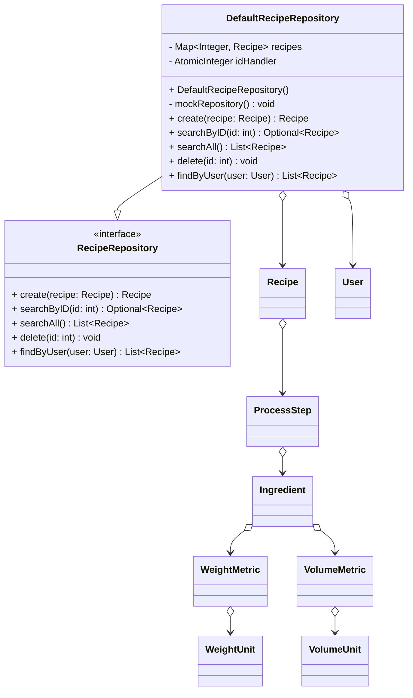

# Programmentwurf
<!--toc:start-->
- [1. Einführung](#1-einführung)
    - [1.1 Übersicht über die Applikation](#11-übersicht-über-die-applikation)
    - [1.2 Wie startet man die Applikation?](#12-wie-startet-man-die-applikation)
    - [1.3 Wie testet man die Applikation?](#13-wie-testet-man-die-applikation)
- [2. Clean Architecture](#2-clean-architecture)
    - [2.1 Was ist Clean Architecture?](#21-was-ist-clean-architecture)
    - [2.2 Analyse der Dependency Rule](#22-analyse-der-dependency-rule)
        - [2.2.1 Positiv-Beispiel: `CustomerRepositoryImpl`](#221-positiv-beispiel-customerrepositoryimpl)
        - [2.2.2 Positiv-Beispiel: `PolicyManagementImpl`](#222-positiv-beispiel-policymanagementimpl)
    - [2.3 Analyse der Schichten](#23-analyse-der-schichten)
        - [2.3.1 Schicht: Applikations-Schicht](#231-schicht-applikations-schicht)
        - [2.3.2 Schicht: Domain-Schicht](#232-schicht-domain-schicht)
- [3. SOLID](#3-solid)
    - [3.1 Analyse Single-Responsibility-Principle (SRP)](#31-analyse-single-responsibility-principle-srp)
        - [3.1.1 Positiv-Beispiel: `BasicPremiumCalculationStrategy`](#311-positiv-beispiel-basicpremiumcalculationstrategy)
        - [3.1.2 Negativ-Beispiel: `WriteCustomerManagementImpl`](#312-negativ-beispiel-writecustomermanagementimpl)
    - [3.2 Analyse Open-Closed-Principle (OCP)](#32-analyse-open-closed-principle-ocp)
        - [3.2.1 Positiv-Beispiel: `PremiumCalculationStrategyFactory`](#321-positiv-beispiel-premiumcalculationstrategyfactory)
        - [3.2.2 Negativ-Beispiel: `WriteCustomerManagementImpl`](#322-negativ-beispiel-writecustomermanagementimpl)
    - [3.3 Analyse Interface-Segregation-Principle (ISP)](#33-analyse-interface-segregation-principle-isp)
        - [3.3.1 Positiv-Beispiel: `ReadCustomerManagement`und `WriteCustomerManagement`](#331-positiv-beispiel-readcustomermanagementund-writecustomermanagement)
        - [3.3.2 Negativ-Beispiel: `CustomerRepository`](#332-negativ-beispiel-customerrepository)
- [4. Weitere Prinzipien](#4-weitere-prinzipien)
    - [4.1 Analyse GRASP: Geringe Kopplung](#41-analyse-grasp-geringe-kopplung)
        - [4.1.1 Positives-Beispiel: `PolicyManagementImpl`](#411-positives-beispiel-policymanagementimpl)
        - [4.1.2 Negatives-Beispiel: `TicketManagementImplTest`](#412-negatives-beispiel-ticketmanagementimpltest)
    - [4.2 Analyse GRASP: Hohe Kohäsion](#42-analyse-grasp-hohe-kohäsion)
    - [4.3 Don’t Repeat Yourself (DRY)](#43-dont-repeat-yourself-dry)
- [5. Unit Tests](#5-unit-tests)
    - [5.1 Zehn Unit Tests - Tabelle](#51-zehn-unit-tests-tabelle)
    - [5.2 ATRIP](#52-atrip)
        - [5.2.1 ATRIP: Automatic](#521-atrip-automatic)
        - [5.2.2 ATRIP: Thorough](#522-atrip-thorough)
            - [5.2.2.1 Positiv-Beispiel](#5221-positiv-beispiel)
            - [5.2.2.2 Positiv-Beispiel](#5222-positiv-beispiel)
        - [5.2.3 ATRIP: Professional](#523-atrip-professional)
            - [5.2.3.1 Positiv-Beispiel](#5231-positiv-beispiel)
            - [5.2.3.2 Negativ-Beispiel](#5232-negativ-beispiel)
    - [5.3 Code Coverage](#53-code-coverage)
    - [5.4 Fakes und Mocks](#54-fakes-und-mocks)
        - [5.4.1 Mock-Objekt: `CustomerRepository`](#541-mock-objekt-customerrepository)
        - [5.4.2 Mock-Objekt: `WriteCustomerManagement`](#542-mock-objekt-writecustomermanagement)
- [6. Domain-Driven-Design (DDD)](#6-domain-driven-design-ddd)
    - [6.1 Ubiquitous Language](#61-ubiquitous-language)
        - [6.1.1 Entities](#611-entities)
        - [6.1.2 Nutzer](#612-nutzer)
        - [6.1.3 Tabelle](#613-tabelle)
    - [6.2 Entities - Policy Entity](#62-entities-policy-entity)
    - [6.3 Value Objects - Premium Value Object](#63-value-objects-premium-value-object)
    - [6.4 Aggregates - Customer Aggregate](#64-aggregates-customer-aggregate)
    - [6.5 Repositories - Customer Repository](#65-repositories-customer-repository)
- [7. Refactoring](#7-refactoring)
    - [7.1 Code Smells](#71-code-smells)
        - [7.1.1 Long Method](#711-long-method)
        - [7.1.2 Duplicated Code](#712-duplicated-code)
    - [7.2 Refactorings](#72-refactorings)
        - [7.2.1 Replace Conditional with Polymorphism](#721-replace-conditional-with-polymorphism)
        - [7.2.2 Extract Method](#722-extract-method)
- [8. Design Patterns](#8-design-patterns)
    - [8.1 Strategy Pattern](#81-strategy-pattern)
    - [8.2 Builder Pattern](#82-builder-pattern)
<!--toc:end-->

# 1. Einführung

## 1.1 Übersicht über die Applikation
Die Anwendung Snackoverflow ist ein lokales Rezeptmanagement Tool. User können mithilfe der  
Anwendung neue Rezepte erstellen, bestehende Rezepte sich ansehen und damit dann "live kochen". Zudem besteht die Möglichkeit, sich Zutaten auf eine  Einkaufsliste zu schreiben.


## 1.2 Wie startet man die Applikation?

## 1.3 Wie testet man die Applikation?

```shell
cd snackoverflow
mvn test
```
Die Testergebnisse werden daraufhin im Terminal angezeigt, für jedes Layer der clean 
architecture einzelnd:


# 2. Clean Architecture

## 2.1 Was ist Clean Architecture?
Clean Architecture ist ein Software-Design-Ansatz, der darauf abzielt, langlebige und flexible 
Systeme zu bauen. Die Kernidee ist, die zentrale Geschäfts- und Anwendungslogik (Domain & 
Application Code) strikt von äußeren technischen Details wie UI, Datenbanken oder Frameworks 
(Plugins & Adapters) zu trennen.   

Dies geschieht durch eine Schichtenstruktur (wie eine Zwiebel) und die Dependency Rule: 
Abhängigkeiten dürfen immer nur von außen nach innen zeigen. Dadurch bleibt der Kern unabhängig 
und testbar, während äußere Technologien (Plugins) leichter ausgetauscht werden können, ohne den 
Kern zu beeinträchtigen. Das Ziel ist, Technologieentscheidungen aufschieben oder revidieren zu 
können und so die Wartbarkeit und Langlebigkeit der Software zu erhöhen.    

## 2.2 Analyse der Dependency Rule

### 2.2.1 Positiv-Beispiel: `DefaultRecipeRepository`



### 2.2.2 Positiv-Beispiel: `DefaultUserRepository`

## 2.3 Analyse der Schichten

### 2.3.1 Schicht: Applikations-Schicht

### 2.3.2 Schicht: Domain-Schicht


# 3. SOLID

## 3.1 Analyse Single-Responsibility-Principle (SRP)

### 3.1.1 Positiv-Beispiel: `BasicPremiumCalculationStrategy`


### 3.1.2 Negativ-Beispiel: `WriteCustomerManagementImpl`


## 3.2 Analyse Open-Closed-Principle (OCP)

### 3.2.1 Positiv-Beispiel: `PremiumCalculationStrategyFactory`


### 3.2.2 Negativ-Beispiel: `WriteCustomerManagementImpl`


## 3.3 Analyse Interface-Segregation-Principle (ISP)

### 3.3.1 Positiv-Beispiel: `ReadCustomerManagement`und `WriteCustomerManagement`


### 3.3.2 Negativ-Beispiel: `CustomerRepository`


# 4. Weitere Prinzipien
## 4.1 Analyse GRASP: Geringe Kopplung

### 4.1.1 Positives-Beispiel: 

### 4.1.2 Negatives-Beispiel: 

## 4.2 Analyse GRASP: Hohe Kohäsion


## 4.3 Don’t Repeat Yourself (DRY)

# 5. Unit Tests
## 5.1 Zehn Unit Tests - Tabelle
Die folgenden aufgeführten Tests befinden sich in der `PolicyManagementImplTest` Klasse.

| Unit Test | Beschreibung |
|-----------|--------------|
| `add_basic_policy` | Testet das Hinzufügen einer BASIC-Policy zu einem Kunden und überprüft die Prämienberechnung und die Anzahl der Policies des Kunden. |
| `add_policy_basic_with_young_driver` | Testet das Hinzufügen einer BASIC-Policy zu einem jungen Fahrer und überprüft die Prämienberechnung und die Anzahl der Policies des Kunden. |
| `add_policy_basic_with_senior_driver` | Testet das Hinzufügen einer BASIC-Policy zu einem älteren Fahrer und überprüft die Prämienberechnung und die Anzahl der Policies des Kunden. |
| `add_basic_policy_with_car_value_fee` | Testet das Hinzufügen einer BASIC-Policy mit einem hohen Autowert und überprüft die Prämienberechnung und die Anzahl der Policies des Kunden. |
| `add_standard_policy` | Testet das Hinzufügen einer STANDARD-Policy zu einem Kunden und überprüft die Prämienberechnung und die Anzahl der Policies des Kunden. |
| `add_deluxe_policy` | Testet das Hinzufügen einer DELUXE-Policy zu einem Kunden und überprüft die Prämienberechnung und die Anzahl der Policies des Kunden. |
| `add_policy_with_too_high_car_value` | Testet das Hinzufügen einer Policy mit einem zu hohen Autowert und überprüft, ob eine `CarTooExpensiveException` geworfen wird. |
| `add_policy_with_customer_under_18_years_old` | Testet das Hinzufügen einer Policy zu einem Kunden unter 18 Jahren und überprüft, ob eine `CustomerTooYoungException` geworfen wird. |
| `increase_all_policies_premium` | Testet die Erhöhung der Prämien aller Policies eines Kunden und überprüft die neue Prämienhöhe. |
| `add_policy_with_customer_not_found` | Testet das Hinzufügen einer Policy zu einem nicht existierenden Kunden und überprüft, ob eine `CustomerNotFoundException` geworfen wird. |

## 5.2 ATRIP
### 5.2.1 ATRIP: Automatic

### 5.2.2 ATRIP: Thorough
#### 5.2.2.1 Positiv-Beispiel

#### 5.2.2.2 Positiv-Beispiel


### 5.2.3 ATRIP: Professional

#### 5.2.3.1 Positiv-Beispiel

#### 5.2.3.2 Negativ-Beispiel


## 5.3 Code Coverage


## 5.4 Fakes und Mocks

### 5.4.1 Mock-Objekt: 

### 5.4.2 Mock-Objekt: 

# 6. Domain-Driven-Design (DDD)
## 6.1 Ubiquitous Language
Bei den Unterabschnitten *6.1.1* und *6.1.2* handelt es sich um Vorarbeiten, die zu der **Ubiquitous Language** in *6.1.3* geführt haben.
### 6.1.1 Entities


### 6.1.2 Nutzer

### 6.1.3 Tabelle

| Bezeichnung | Bedeutung                                                                               | Begründung                                                                                                                                                                                                                                                           |
|-------------|-----------------------------------------------------------------------------------------|----------------------------------------------------------------------------------------------------------------------------------------------------------------------------------------------------------------------------------------------------------------------|
| Policy      | eine Versicherung, die ein Kunde für ein Auto abgeschlossen hat                         | Ein Kunde schließt einen Vertrag für jede seiner Versicherungen ab (Insurance Policy). Bei einer Autoversicherung werden nur diese Art von Verträgen verwaltet, deswegen die kürzere Bezeichnung.                                                                    |
| Ticket      | Verkehrsverstöße von Kunden für zu schnelles Fahren                                     | Bei einer einer Autoversicherung sind für die Kostenberechnung einer Policy Geschwindigkeitsüberschreitungen releveant, da dadurch das Risiko eines Schadens erhöht wird. Andere Arten von Verkehrsvergehen, wie falsches Parken, werden dabei nicht berücksichtigt. |
| Customer    | natürliche Person, die Kunde bei der von der Anwendung verwalteten Autoversicherung ist | Kunden schließen einen Vertrag bei der Autoversicherung ab. Die Nutzer der Anwendung sind Mitarbeiter der Autoversicherung und tragen die Daten für die jeweiligen Kunden in das System ein.                                                                         |
| Premium     | die monatlichen Kosten einer Policy, um diese aktiv zu halten                           | Im Rahmen einer Versicherung wird Premium als der monatlich zu entrichtende Betrag definiert                                                                                                                                
## 6.2 Entities - Policy Entity


## 6.3 Value Objects - Premium Value Object


## 6.4 Aggregates - Customer Aggregate


## 6.5 Repositories - Customer Repository


# 7. Refactoring
## 7.1 Code Smells
### 7.1.1 Long Method


### 7.1.2 Duplicated Code


## 7.2 Refactorings

### 7.2.1 Replace Conditional with Polymorphism


### 7.2.2 Extract Method


# 8. Design Patterns
## 8.1 Strategy Pattern

## 8.2 Builder Pattern
